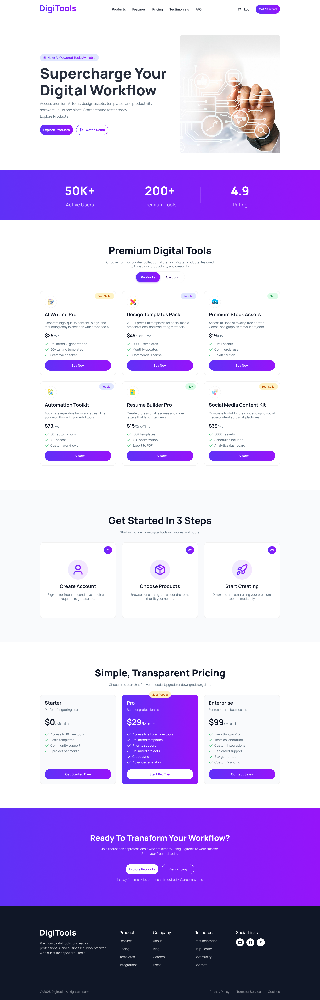

    <h1>DIGITOOLS PLATFORM [ASSIGNMENT 6]</h1>

## ABOUT

Digitools Platform is a modern marketplace designed for developers and tech enthusiasts to browse, compare, and manage digital products. This project was developed as part of **Programming Hero Assignment 6**, focusing on dynamic data rendering and state management.

    

        
        
    

## TECH STACK

     

## UI DESIGN

  

    <h1>ASSIGNMENT INSTRUCTIONS</h1>
    <h2>[Features & Requirements]</h2>

## Navbar
- Navbar designed according to Figma  
- Cart icon displayed (initially empty)  

## Banner
- Banner section includes:
  - Heading  
  - Description text  
  - Image  
  - Buttons  

## Stats Section
- Stats section designed based on Figma  

## Main Section & Toggling
- Design  2 buttons at the center of the section.
- By clicking Cart,  the cart section will be shown. By default it will show an empty message.
- By Clicking  Product,  the Products section will be shown. 
- By Default product section will be visible. 

## JSON Data
Create 6–10 product data with:
- id  
- name  
- description  
- price  
- period (one-time / monthly / yearly)  
- tag ( example- popular, new, best seller) 
- tagType ( example- popular, new, best seller) 
- features ( array. Example:  ["100+ templates", "ATS optimization", "Export to PDF"] )   
- icon  

## Product Cards
- Display all products in a 3-column layout  
- Each card includes:
  - Name  
  - Description  
  - Price  
  - Period  
  - TagType  
  - Features  
  - Icon  
  - Buy Now button  

## Cart Functionality
- Show selected products in cart  
- Display total product count in navbar  
- Cart layout: 1 column  
- Each cart item includes:
  - Name  
  - Icon  
  - Price  
  - Remove button  
- "Proceed to Checkout" button:
  - Clears all cart items  

## Steps Section
- Designed according to Figma  

## Pricing Section
- Designed according to Figma  

## Footer
- Footer designed based on Figma  

## Responsive Design
- Fully responsive across devices  
- Follow standard responsive practices  

    <h1>[Challenges Part]</h1>

## Use a NPM Package React-Toastify
- Use **React Toastify** to show all the alerts of add to cart, remove, and proceed to checkout. 

## Implement Selected product remove functionality 
- On Click Remove Button product will remove from cart section.

- In this section the total of the selected products ( added on the carts) will show here. 
- Proceed to checkout button will remove all the products from the cart  

## Optional Features: 

1. When you click on a product it increases the cart count in the Navbar and clears it when you click on the proceed to checkout button. 
2. When clicking on the Buy now Button it shows an “Added to cart” message on the button. 